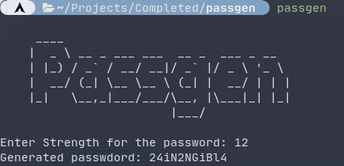

A simple & minimal password generator written in python.

## Installation
To install this program on linux, copy the main.py file to ~/.local/bin/passgen or /usr/bin/passgen (it's safe).
```bash 
$ git clone <repo of project>
# cp ./passgen/main.py /usr/bin/passgen
```
Or in Windows, just git clone the repo and add main.py to the path.

## Usage
After the installation you can run the `passgen` command and enter the strength of password to generate, and the random strong password will come to your terminal/command prompt.


